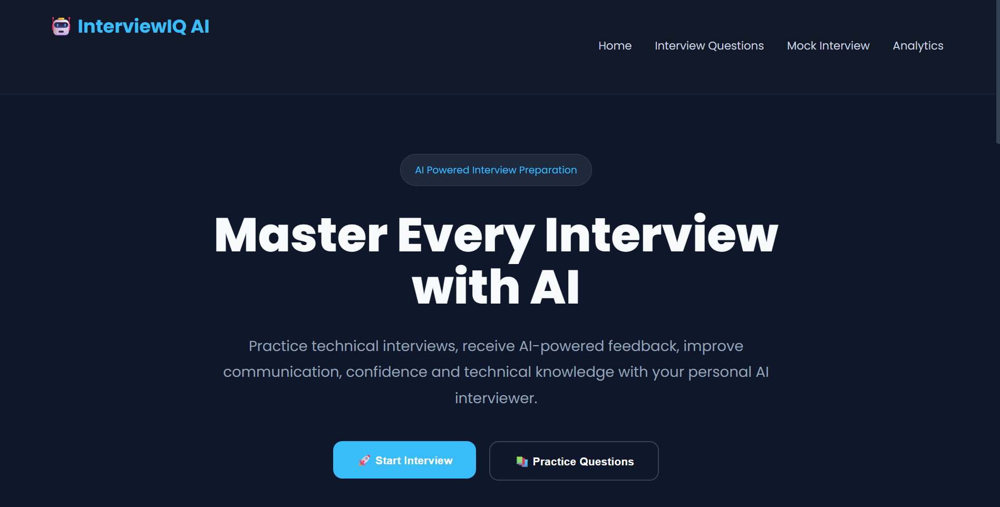
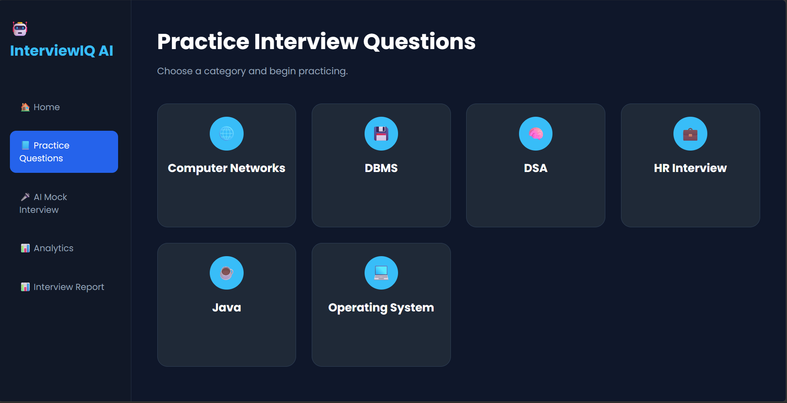
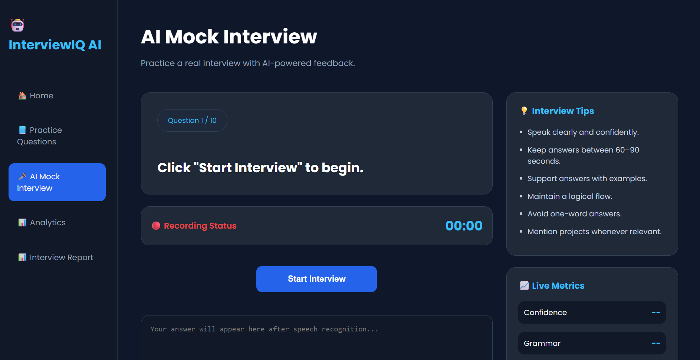
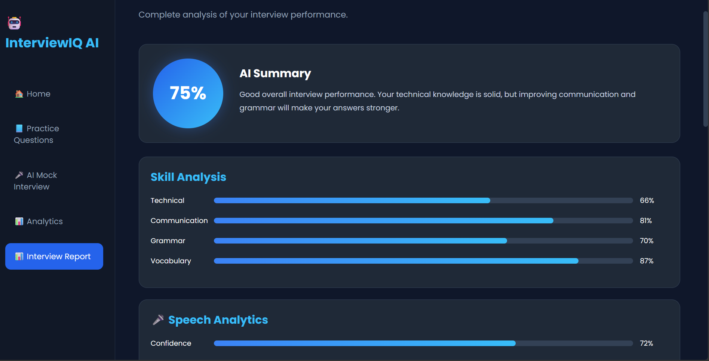
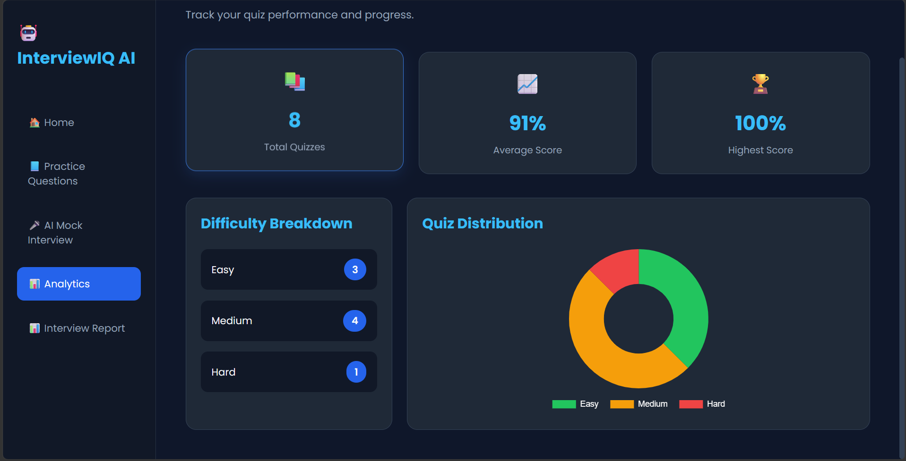

# AI Interview Preparation System

An AI-powered Interview Preparation System that helps students and job seekers prepare for technical and HR interviews through quizzes and AI-driven mock interviews. The application evaluates candidate responses and provides personalized feedback on technical knowledge, communication, confidence, grammar, vocabulary, speech rate, and overall interview performance.

---

# Features

## 📚 Quiz Module

- Category-based interview questions
- Multiple difficulty levels (Easy, Medium, Hard)
- Instant score calculation
- Progress tracking
- Dashboard analytics

## 🤖 AI Mock Interview

- AI-generated interview questions using Google Gemini
- Technical and HR interview practice
- Interactive interview sessions
- AI answer evaluation
- Ideal answer generation

## 📊 Performance Analysis

- Overall interview score
- Technical score
- Grammar score
- Communication score
- Vocabulary analysis
- Confidence score
- Speech rate analysis
- Fluency analysis
- Strengths identification
- Weaknesses identification
- Personalized improvement suggestions

## 📈 Dashboard

- Quiz statistics
- Average score
- Total quizzes attempted
- Performance summary

---

# Screenshots

## Home Page



---

## Quiz Module



---

## AI Mock Interview



---

## Interview Report



---

## Dashboard



---

# Tech Stack

## Frontend

- HTML5
- CSS3
- JavaScript

## Backend

- Java
- Spring Boot
- Maven

## Database

- MySQL

## AI Integration

- Google Gemini API

---

# Project Structure

```
AI-Interview-Preparation-App
│
├── backend
│   └── interviewprep
│       ├── src
│       ├── pom.xml
│       └── application.properties
│
├── frontend
│   ├── css
│   ├── js
│   ├── index.html
│   ├── categories.html
│   ├── difficulty.html
│   ├── questions.html
│   ├── result.html
│   ├── dashboard.html
│   ├── mockinterview.html
│   └── interviewreport.html
│
├── database
│   └── interviewprep.sql
│
├── screenshots
│
└── README.md
```

---

# Installation Guide

## 1. Clone the Repository

```bash
git clone https://github.com/pragati-003/AI-Interview-Preparation-App.git
```

---

## 2. Open the Backend

Open the **backend/interviewprep** project in IntelliJ IDEA or any Java IDE.

---

## 3. Configure MySQL

Create a database named:

```sql
interviewprep
```

---

## 4. Import the Database

Open **MySQL Workbench**.

Navigate to:

```
Server → Data Import
```

Select:

```
database/interviewprep.sql
```

Click:

```
Start Import
```

---

## 5. Configure application.properties

Replace the placeholders with your own database credentials and Gemini API key.

```properties
spring.datasource.url=jdbc:mysql://localhost:3306/interviewprep
spring.datasource.username=YOUR_MYSQL_USERNAME
spring.datasource.password=YOUR_MYSQL_PASSWORD

spring.jpa.hibernate.ddl-auto=update
spring.jpa.show-sql=true

gemini.api.key=YOUR_GEMINI_API_KEY
```

---

## 6. Run the Backend

Run:

```
InterviewprepApplication.java
```

The backend starts on:

```
http://localhost:8080
```

---

## 7. Run the Frontend

Open:

```
frontend/index.html
```

or use **Live Server** in Visual Studio Code.

---

# Application Workflow

```
                    AI Interview Preparation System

                               Home
                                 │
               ┌─────────────────┴─────────────────┐
               │                                   │
           Quiz Module                     AI Mock Interview
               │                                   │
       Select Category                    Start Interview
               │                                   │
      Select Difficulty              AI Generates Questions
               │                                   │
         Attempt Quiz                 Submit Spoken/Written Answer
               │                                   │
        View Result                  AI Evaluates Response
               │                                   │
        Dashboard Analytics        Interview Report & Feedback
```

---

# Future Enhancements

- User Authentication
- Resume Analyzer
- Voice Emotion Detection
- Interview History
- Cloud Deployment
- Admin Dashboard
- Leaderboard
- Personalized Learning Recommendations

---

# Author

**Pragati Parmar**

B.Tech – Artificial Intelligence & Machine Learning


---

# License

This project is intended for educational and learning purposes.
